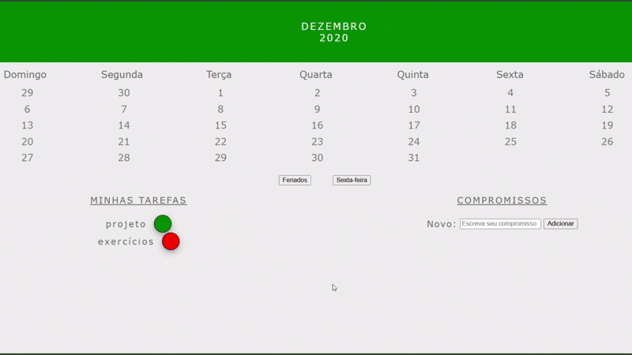

# 📅 Tryber Calendar


Este é um projeto **acadêmico** desenvolvido como parte dos estudos de JavaScript e manipulação do DOM. Ele simula um calendário interativo do mês de dezembro, com funcionalidades como destacar feriados, modificar sextas-feiras, interações com tarefas e efeitos visuais nos dias.

🔗 **Acesse o projeto online:**  
https://raphafratel.github.io/tryber-calendar/

---

## 🧠 Conceitos praticados

Durante o desenvolvimento deste projeto, foram exercitados os seguintes tópicos fundamentais de JavaScript:

- Manipulação da **DOM** (`document.querySelector`, `createElement`, `appendChild`, etc.)
- Criação e uso de **event listeners** (`click`, `mouseover`, `mouseout`, `keydown`)
- **Classes CSS dinâmicas** com `classList.add()` e `classList.remove()`
- **Estilização direta** via JavaScript (`style.property`)
- Uso de **arrays** e estruturas de repetição (`for`, `forEach`)
- Boas práticas como **validação de entrada** e **controle de estado**

---

## 🛠️ Como rodar localmente

Para executar o projeto em seu ambiente local, siga os passos abaixo:

1. **Clone o repositório:**
   ```bash
   git clone https://github.com/raphafratel/tryber-calendar.git
   cd tryber-calendar
   npm install

## 📄 Licença
Projeto acadêmico sem fins comerciais. Livre para estudo e modificação com créditos.


